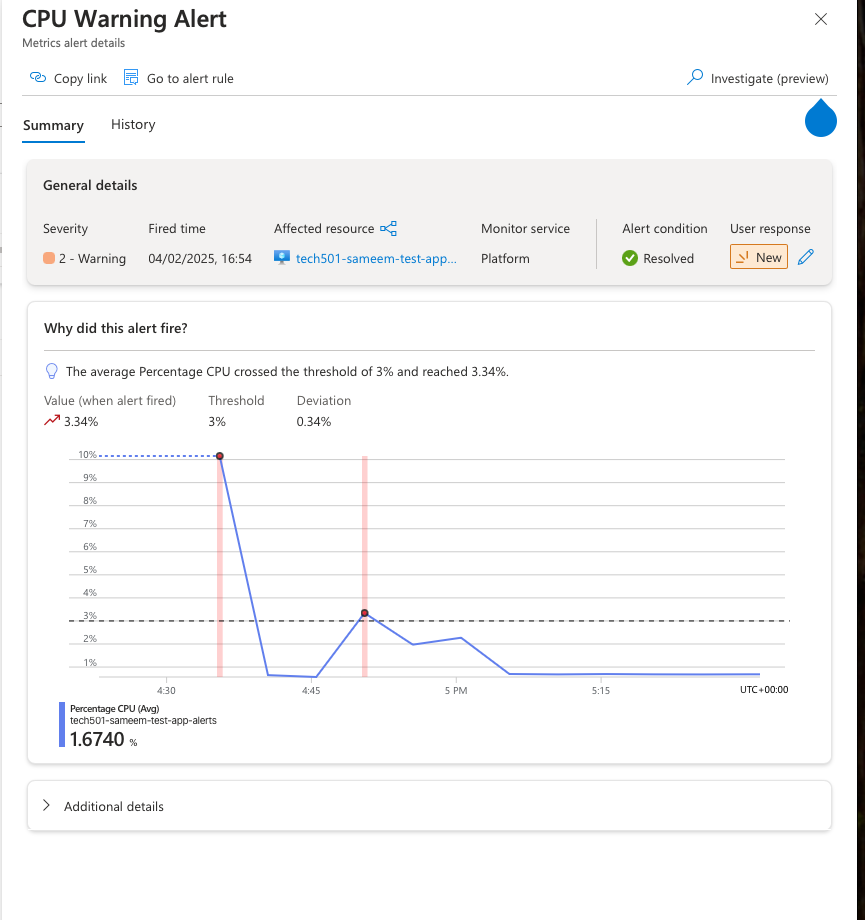
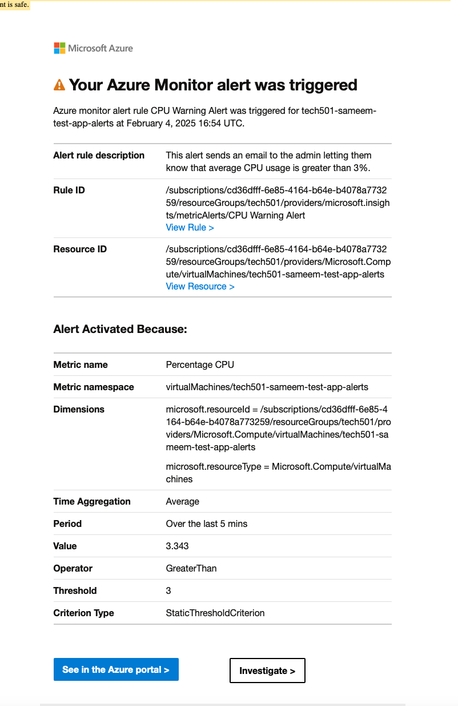
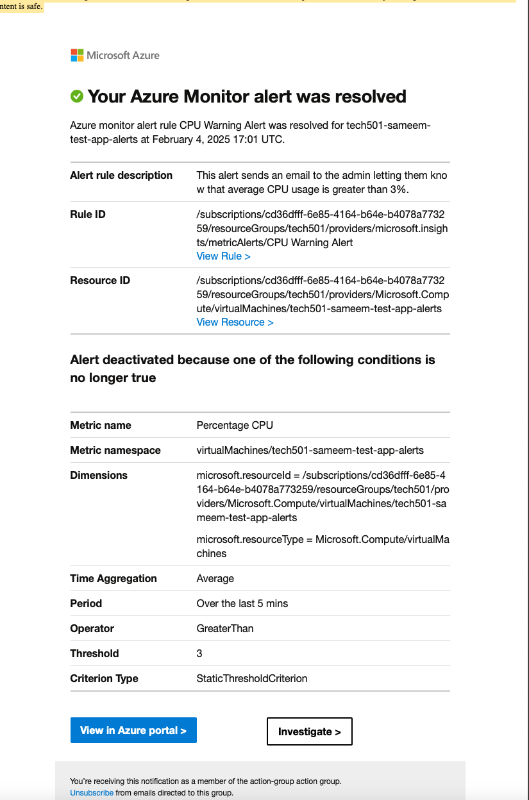

# Azure Monitor

- [Azure Monitor](#azure-monitor)
  - [Introduction](#introduction)
  - [Azure Monitor Key Features](#azure-monitor-key-features)
  - [Creating dashboards](#creating-dashboards)
  - [Load testing with ApacheBench](#load-testing-with-apachebench)
  - [Alerts](#alerts)
    - [Setting up CPU Usage Alert for our Application](#setting-up-cpu-usage-alert-for-our-application)
      - [Step 1: Set Up the Alert in Azure Monitor](#step-1-set-up-the-alert-in-azure-monitor)
      - [Step 2: Perform Stress Testing with ApacheBench](#step-2-perform-stress-testing-with-apachebench)
      - [Step 3: Monitor the Alert](#step-3-monitor-the-alert)

## Introduction

- Azure Monitor is a comprehensive monitoring service provided by Microsoft Azure that helps you maximize the availability and performance of your applications and services.
- It delivers a full stack monitoring solution that collects, analyses, and acts on telemetry data from your cloud and on-premises environments.
- Equivalent to AWS CloudWatch.

## Azure Monitor Key Features

- **Data Collection**: Gathers metrics and logs from various Azure resources, applications, and the operating system.
- **Analysis**: Provides powerful analytics tools to help you understand the performance and health of your applications.
- **Visualisation**: Allows you to create custom dashboards and workbooks to visualize your data.
- **Alerts**: Enables you to set up alerts to notify you of critical conditions and automate responses.
- **Integration**: Integrates with other Azure services and third-party tools for a seamless monitoring experience.

Azure Monitor helps you gain deep insights into your applications, proactively identify issues, and maintain optimal performance.

## Creating dashboards

- Can create custom dashboards tracking various metrics e.g. average CPU usage, R/W disk operations, network load etc.
- Can pin these charts to our dashboard, and rearrange viewing, refresh interval, time-range in view etc.


## Load testing with ApacheBench

- Install apache2 utils with ab(ApacheBench) utility:

```bash
sudo apt-get install apache2-utils
```

- Need to use this tool to simulate user experience for our application i.e. at what point do we get congestion (whether CPU, network etc) that results in a poor user experience e.g. app takes 1 minute to load.

- Send 10000 requests in blocks of 200. Note, can have a timeout so may not send all the requests.

```bash
ab -n 10000 -c 200 http://<public_ip_address>/
```

- Once we have determined the saturation point, can set up alerts e.g. at 70% CPU usage alert me with a text message. And ultimately can add vertical scaling (more CPU, RAM etc) or horizontal scaling (more app instances with load balancing).

- Also observe the effects of our requests in the dashboard, although due to the simplicity of our application, the spikes may be minimal.

## Alerts

- Can configure alerts to admin based on pre-defined conditions e.g. if CPU usage > 80%, send a text message or email notification.

### Setting up CPU Usage Alert for our Application

- In our case, because the application is very simple and places minimal stress on the CPU, we will test out an average CPU usage alert where crossing 3% threshold will send an email notification to the admin.

#### Step 1: Set Up the Alert in Azure Monitor

1. **Navigate to Azure Portal**:
   - Go to the Azure Portal (https://portal.azure.com).

2. **Select Your VM**:
   - Navigate to the Virtual Machine you want to monitor.

3. **Create an Alert Rule**:
   - In the VM's menu, select **Alerts** under the **Monitoring** section.
   - Click on **+ New alert rule**.

4. **Configure the Alert Rule**:
   - **Scope**: Ensure the correct VM is selected.
   - **Condition**: Click on **Add condition**.
     - Search for and select **Percentage CPU**.
     - Set the **Threshold value** to `3`.
     - Set the **Aggregation type** to `Average`.
   - **Action Group**: Click on **Add action group** to create or select an existing action group to notify you by email.
   - **Alert Details**: Provide a name and description for the alert rule.

5. **Create the Alert**:
   - Click on **Create alert rule**.

#### Step 2: Perform Stress Testing with ApacheBench

- As previously, send number of requests to put an adequate load on the CPU e.g. 2000 in our case may suffice.

#### Step 3: Monitor the Alert

1. **Check Azure Monitor**:
   - Go back to the Azure Portal and navigate to **Monitor**. Check the **Alerts** section to see if the alert has been triggered.

   

2. **Verify Notification Emails**:
   - Ensure that you receive the email notifications as configured in the action group.

   

   - May also receive an email once the issue is resolved.

   
