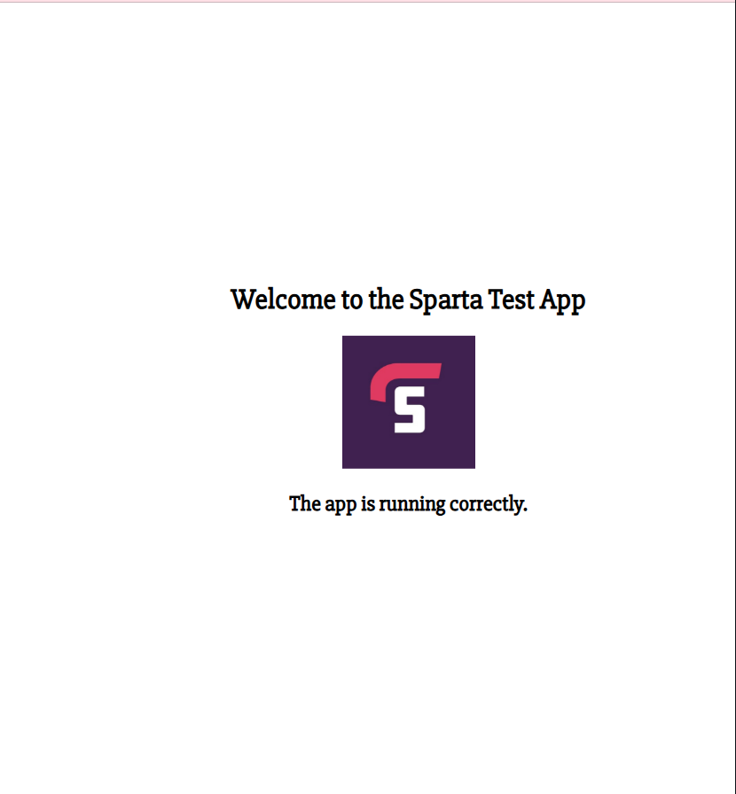

# Sparta Node.js test app

- [Sparta Node.js test app](#sparta-nodejs-test-app)
  - [Manual Deployment to Azure VM](#manual-deployment-to-azure-vm)
    - [Create VM](#create-vm)
    - [SSH into VM](#ssh-into-vm)
    - [Run Commands](#run-commands)
    - [Get app code onto the VM](#get-app-code-onto-the-vm)
      - [1. SCP from local machine to the VM](#1-scp-from-local-machine-to-the-vm)
      - [2. Git Clone from GitHub repository](#2-git-clone-from-github-repository)
    - [Run the application](#run-the-application)
    - [Accessing the Application](#accessing-the-application)
  - [Future deployment using generalised Azure image of VM](#future-deployment-using-generalised-azure-image-of-vm)
    - [1. Document your Commands for Dependencies](#1-document-your-commands-for-dependencies)
    - [2. Move App Code to the Root Directory](#2-move-app-code-to-the-root-directory)
    - [3. Run the waagent command](#3-run-the-waagent-command)
    - [4. Create the Azure Image](#4-create-the-azure-image)
    - [5. Test the image](#5-test-the-image)
  - [Add Nginx Reverse Proxy](#add-nginx-reverse-proxy)
  - [Run app in background with pm2](#run-app-in-background-with-pm2)

## Manual Deployment to Azure VM

### Create VM

- Name: tech501-sameem-first-deploy-app-vm
- Image: Ubuntu Server 22.04 LTS - x64 gen2
- Use SSH authentication with your public key stored in azure
- Create advanced networking rule, to allow http (80), ssh (22) and node (3000): `tech501-sameem-sparta-app-allow-HTTP-SSH-3000`

### SSH into VM

- `ssh -i <private key path> <username>@<VM public IP>`
- `uname --all` tells you about the image you are running.

### Run Commands

- Once you've logged on to the VM, run these commands:

  - To check and update package lists: `sudo apt update && sudo apt upgrade -y`
  - To install nginx: `sudo apt install nginx -y`
  - To ensure nginx is running:`sudo systemctl status nginx` 
  - To install npm and node.js: `sudo DEBIAN_FRONTEND=noninteractive bash -c "curl -fsSL https://deb.nodesource.com/setup_20.x | bash -" && \ sudo DEBIAN_FRONTEND=noninteractive  apt-get install -y nodejs`
  - Check installations by running: `node -v` and `npm -v`.

### Get app code onto the VM

- Download code and extract onto your local machine.
- Follow one of the methods below.

#### 1. SCP from local machine to the VM

- Transfer to VM using SCP: `scp -i <private key path> -r <path to downloaded app> <username>@<VM public IP>:~`

#### 2. Git Clone from GitHub repository

- Create local git repository on your local machine and push to GitHub.
- SSH into the VM and run`git clone <repo url>` to get the app code from GitHub onto the VM.

### Run the application

- Within the VM terminal, `cd` into the `app` directory of the repository.
- Run `npm install` to install dependencies.
- Run `npm start` to start the application on port 3000.

### Accessing the Application

- To access the application, in the browser search bar enter: `<VM public IP>:3000`.
- You should see the application appear as below.



## Future deployment using generalised Azure image of VM

- The steps below prepare the node.js test app for generalisation.
- The result is an azure image that can be used to deploy a number of VMs with the required source code and dependencies to run the application, skipping all the  manual steps we had to do previously.

### 1. Document your Commands for Dependencies

- This can include updating packages, installing nginx, nodejs and npm, and other dependencies.
- You can store this in a markdown file or in my case, a [bash script](/nodejs_app_deployment/deploy_nodejs_app.sh).
- These may be needed for troubleshooting or reinstallation later so needs to be kept safe.
  
### 2. Move App Code to the Root Directory

- Navigate to your home directory or wherever the repository is stored.
- Move the app code to the root directory:

```bash
mv app_repo /
```

- Ensure the whole repository has been moved to the root, before proceeding.

### 3. Run the waagent command

- The `waagent` command prepares the VM for generalisation by cleaning up user-specific data, including the `adminuser` directory.

```bash
sudo waagent -deprovision+user -force
```

- This will:
  - Remove the `adminuser` account.
  - Clean SSH keys and other user-specific configurations.

### 4. Create the Azure Image

1. Stop the VM first, ensure it is in a deallocated state.
2. Create the image from the **virtual machine overview** page using `capture` by clicking **capture** near the top of the page. Ensure image is named correctly, and image OS is selected as Linux (since it is a Node.js app running on Ubuntu). Click **Review + Create** and complete the image creation if it all looks good.
3. Verify image is created.

### 5. Test the image

- Create a new VM with the image and test the node.js app runs as previously.

- If all looks good, congratulations! You have successfully created a generalised Azure image with the node.js app, and deployed it to a new VM!

## Add Nginx Reverse Proxy

- By adding Nginx reverse proxy, can access the app via our default port 80 rather than port 3000.
- Edit nginx config file in: `/etc/nginx/sites-available/default` and add the line: `proxy_pass http://127.0.0.1:3000;` to the location field.
- Check you can access the app without specifying port 3000, i.e. it will use default port 80 and should work just the same!

## Run app in background with pm2

- PM2 is a popular process manager for Node.js applications. It allows you to:

  - Run your app in the background (even after you close the terminal).
  - Manage multiple applications (start, stop, restart).
  - Automatically restart your app if it crashes.
  - Monitor the performance of your app.
  - Enable auto-start on server reboot.

- PM2 preferred over `&` to manage and run nodejs instances.

- Install pm2 globally.

```bash
sudo npm install -g pm2
```

- Start app with pm2.

```bash
pm2 start app.js
```

- Check Status of the App.

```bash
pm2 list
```

- Stop the app.

```bash
pm2 stop app
```

- Restart app.

```bash
pm2 restart app
```

- Delete app from pm2 list.

```bash
pm2 delete app
```

- View logs.

```bash
pm2 logs
```

- Make the app start on reboot.

```bash
pm2 startup
```

- Save your current pm2 process list to be restored on reboot.

```bash
pm2 save
```
